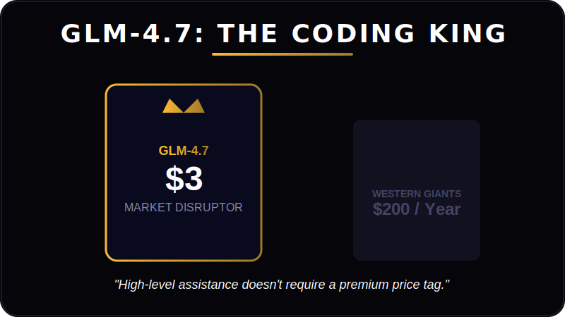
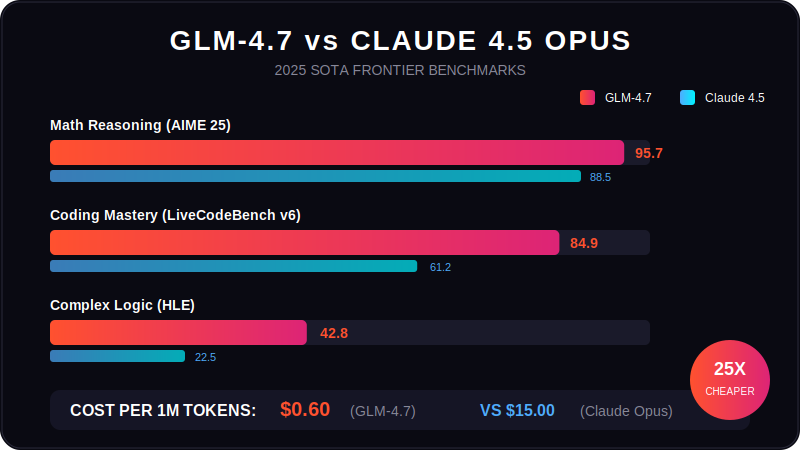

# GLM-4.7 vs. The $200 Giants: Is China’s $3 AI Coding Tool the New Market King?

The global landscape for AI-powered development is shifting. While Western tools like Cursor and GitHub Copilot have dominated by charging premium subscription rates (often reaching $200 per year), a new contender from China has arrived to dismantle that pricing model.

Zhipu AI has released **GLM-4.7**, a large language model specifically engineered for coding, offering performance that rivals top-tier US models at a fraction of the cost. With a price point hovering around **$3 (1 RMB)** for significant usage, GLM-4.7 is forcing developers to question if expensive subscriptions are still necessary.

## The Core Showdown: Price vs. Performance

The most immediate differentiator is the economic disruption. For months, the "standard" for advanced AI coding in the US has been a high barrier to entry. GLM-4.7 challenges this by offering enterprise-level code generation, debugging, and analysis for a negligible fee.

| Feature | Western Incumbents (e.g., Cursor Pro) | The New Challenger (GLM-4.7) |
| :--- | :--- | :--- |
| **Cost** | ~$200 / year (Subscription) | **~$3 / month (GLM Coding Plan)** |
| **Developer** | OpenAI / Microsoft Partnerships | Zhipu AI (China) |
| **Primary Sell** | Workflow Integration & Ecosystem | **Raw Power & Open-Source SOTA** |
| **Target Audience** | Professional Enterprise Teams | Cost-conscious & Elite Indie Devs |

### 2025 SOTA Benchmarks: GLM-4.7 vs. The World

Recent independent benchmarks from late 2025 showcase GLM-4.7's dominance in the open-source and frontier-model space.

*   **Coding Mastery:** Scored **84.9%** on LiveCodeBench v6, significantly outperforming Claude 4.5 Sonnet in raw competitive programming.
*   **Math Reasoning:** Achieved a staggering **95.7%** on AIME 2025, proving its superior logical depth.
*   **Software Engineering:** Boasts **73.8%** on SWE-bench Verified, rivaling GPT-5.1 levels of codebase management.

## What is GLM-4.7? The Technical Breakdown

GLM-4.7 is the latest flagship iteration of the General Language Model series. Unlike general-purpose models, GLM-4.7 is a **358B parameter MoE (Mixture of Experts)** beast optimized heavily for code generation, function calling, and agentic workflows.

### Key Technical Highlights:

1.  **Interleaved & Preserved Thinking:** Unlike models that "blindly" copy-paste, GLM-4.7 uses advanced thinking modes to self-correct and plan before every action. It automatically retains these thinking blocks across conversations to maintain context.
2.  **Extended Context Window:** With a window of up to **200K tokens**, it can ingest and "remember" entire complex file structures better than almost any model in its class.
3.  **All-Tools Integration:** GLM-4.7 can autonomously browse the web, execute terminal commands, and interpret data, making it a "SOTA Agent" capable of end-to-end task execution.
4.  **Vibe Coding Excellence:** Significant improvements in UI/UX generation, producing modern, cleaner code for frontend development and design-heavy tasks.

## Why This Matters for the Future of DevOps

This release signals a pivotal moment in the AI coding war. For CTOs and engineering managers, the calculation is changing. The "value add" of a $200 tool is no longer just about ability (can it write code?), but about **ROI**.

If a $3 model can perform 90-100% of the tasks that a $200 model can—and in some cases, outperform them—the justification for high-cost enterprise licenses evaporates. This pressure will likely force Western competitors to lower prices or significantly boost their feature sets to maintain market share.

---

## FAQ: GLM-4.7 and the AI Coding Market

**Is GLM-4.7 better than GPT-5.1 for coding?**
While GPT-5.1 maintains a slight edge in general ecosystem integration, GLM-4.7 is the **#1 Open-Source model on LMArena**, often outperforming proprietary giants in pure coding syntax and logic-heavy tasks.

**How much does the GLM-4.7 coding tool cost?**
The GLM Coding Plan is priced at just **$3/month**, offering roughly **3x the usage quota** of plans like Claude Pro at **1/7th of the cost**.

**Can I use GLM-4.7 with my current tools?**
Yes! GLM-4.7 is fully integrated with popular agent frameworks like **Claude Code, Cline, Roo Code, and Kilo Code**.

---

## The Verdict

The era of the "$200 AI coding tax" is ending. With GLM-4.7, Zhipu AI has proven that high-level code assistance doesn't require a premium price tag. For developers looking to maximize their margins and leverage the most advanced agentic reasoning available, the smart money is on the challenger.

### 🎄 Christmas Special Offer!
Don't miss out on the massive **Xmas Discount**! Get an **additional 10% OFF** your subscription by using the invite code and link below:

👉 [**Claim Your GLM-4.7 Discount Here**](https://z.ai/subscribe?ic=R0K78RJKNW)

*Unlock the power of the King of Coding for less than the price of a coffee.*
