<p align="center">
  
</p>

<h1 align="center">🤖 Ultimate Custom Engineered TRAE Agents</h1>
<h3 align="center">Uncapped AI Agents Collection</h3>

<p align="center">
  <a href="#-trae-and-glm-model---integration-guide">📖 Guide</a> •
  <a href="#-available-agents">🎯 Agents</a> •
  <a href="#-virtual-machine-for-ai-coding-free---anywhere">☁️ Cloud VM</a> •
  <a href="#-awesome-mcps">🌟 MCPs</a> •
  <a href="#-hacks">💡 Hacks</a> •
  <a href="#-vibe-games">🕹️ Games</a>
</p>

## 📖 TRAE and GLM Model - Integration Guide

**Setup GLM-4.6 with TRAE:**
*   🎟️ **Need a plan?** Do this first: [**Get 10% Discount** on GLM Models](https://z.ai/subscribe?ic=R0K78RJKNW)
*   📄 **Having GLM Plan already?** [**GLM-4.6 Integration Guide (PDF)**](./Adding_GLM_4.6_Model_to_TRAE__A_Visual_Guide__3_.pdf)

## 🚀 Why use SOLO with GLM 4.6?

*   **Save Your Fast Tokens:** Running the SOLO agent with the GLM 4.6 model **does not consume your TRAE paid fast tokens**.
*   **Cost-Effective Scaling:** Perform extensive, autonomous coding tasks without draining your premium credits.
*   **Optimized Workflow:** Reserve your TRAE fast tokens for urgent, high-priority interactive tasks while letting SOLO handle the heavy lifting in the background using GLM 4.6.

## 🎯Latest Hackathon participation
*   **OffLogic** Game is the ultimate reflex challenge for developers and UI designers. 
    An interactive experience that tests your coding speed, precision, and aesthetic preference.
*   [Souce code of OffLogic](./vibecoding-games/OFFLOGIC_98_v3._classic_version.html)

## 🤖 Available Agents

### OPUS Series

1. **Claude Opus 4.5 Wrap**
   <a href="https://s.trae.ai/a/c5a3e9">
     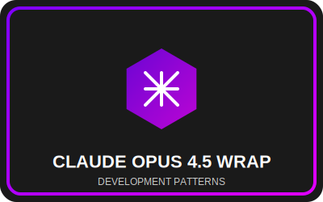
   </a>
   - **[Install Agent](https://s.trae.ai/a/c5a3e9)**
   - Offers major models some of the development patterns of the popular Claude Opus 4.5 model (Veriation 1).

2. **OPUS FRAMEWORK 4.5**
   <a href="https://s.trae.ai/a/114be4">
     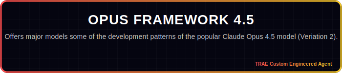
   </a>
   - **[Install Agent](https://s.trae.ai/a/114be4)**
   - Offers major models some of the development patterns of the popular Claude Opus 4.5 model (Veriation 2).

3. **OPUS QA ENGINEER**
   <a href="https://s.trae.ai/a/01708c">
     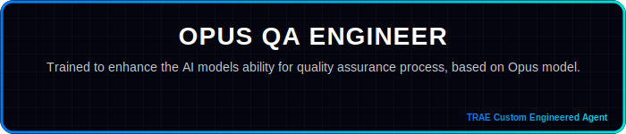
   </a>
   - **[Install Agent](https://s.trae.ai/a/01708c)**
   - Trained to enhance the AI models ability for quality assurance process, based on Opus model.

### Specialized Agents

4. **KIRO TRAE ULTRA X**
   <a href="https://s.trae.ai/a/25f7a7">
     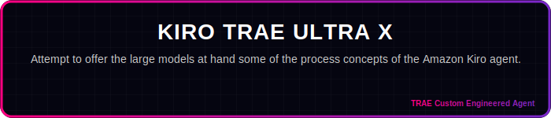
   </a>
   - **[Install Agent](https://s.trae.ai/a/25f7a7)**
   - Attempt to offer the large models at hand some of the process concepts of the Amazon Kiro agent. More agent autonomous, less distruptive developemt.

5. **Apex Omni**
   <a href="https://s.trae.ai/a/4c48cd">
     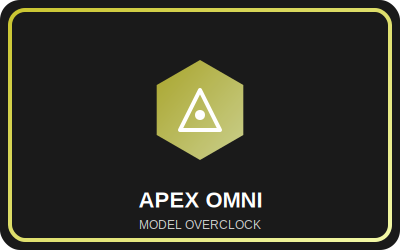
   </a>
   - **[Install Agent](https://s.trae.ai/a/4c48cd)**
   - The "overclock" agent, offers lower end models like Gemini 2.5 Flash, a set of the high end model operation "skills". Mostly tested with Gemini 2.5 Flash model.

6. **PWA Generator for TRAE IDE**
   <a href="https://s.trae.ai/a/a5ec8c">
     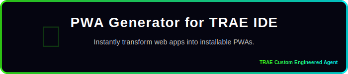
   </a>
   - **[Install Agent](https://s.trae.ai/a/a5ec8c)**
   - Instantly transform web apps into installable PWAs. Automates manifest creation, service worker setup, and icon generation within TRAE IDE.

7. **Loop Breaker**
   <a href="https://s.trae.ai/a/8a1286">
     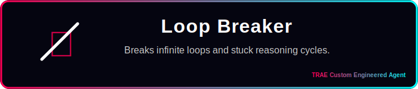
   </a>
   - **[Install Agent](https://s.trae.ai/a/8a1286)**
   - A fun agent designed to break infinite loops and resolve stuck reasoning cycles in your AI development workflow. It may not break every loop out there, but certainly should help with some.  Try, test and feel free sharing your feedback.
  

### Defense Series

6. **Amnesia Defense**
   <a href="https://s.trae.ai/a/0bfb9e">
     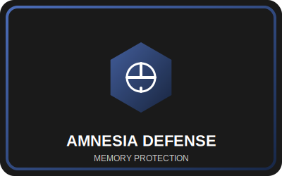
   </a>
   - **[Install Agent](https://s.trae.ai/a/0bfb9e)**
   - You know how the AI could tell you, some work is done, but then nothing is done? This model enhances the process to minimize those occurances.

7. **ANTI-AMNESIA v2**
   <a href="https://s.trae.ai/a/3f7075">
     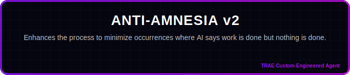
   </a>
   - **[Install Agent](https://s.trae.ai/a/3f7075)**
   - You know how the AI could tell you, some work is done, but then nothing is done? This model enhances the process to minimize those occurances.

## 🚀 Boost Efficiency with SOLO & GLM 4.6

<a href="https://www.trae.ai/s/WJtxyE">
  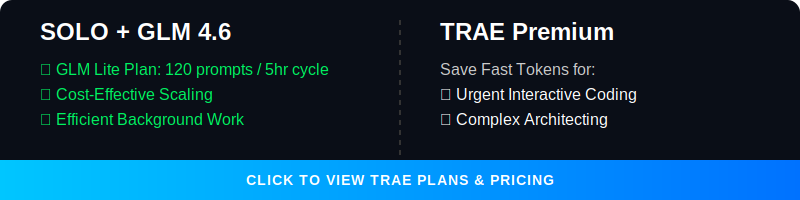
</a>

Unlock the full potential of your development workflow by combining **TRAE's SOLO Agent** with the **GLM 4.6 model**.

### Why use SOLO with GLM 4.6?

*   **Save Your Fast Tokens:** Running the SOLO agent with the GLM 4.6 model **does not consume your TRAE paid fast tokens**.
*   **Cost-Effective Scaling:** Perform extensive, autonomous coding tasks without draining your premium credits.
*   **Optimized Workflow:** Reserve your TRAE fast tokens for urgent, high-priority interactive tasks while letting SOLO handle the heavy lifting in the background using GLM 4.6.

[**Explore TRAE Plans & Start for Free**](https://www.trae.ai/s/WJtxyE)

## 🛠️ GLM 4.6 Alternative IDE Options

The GLM 4.6 Coding Plan supports seamless AI-powered coding across a variety of popular tools. Once subscribed, GLM-4.6 is automatically available in these environments without complex configuration.

### Supported Clients & IDEs

*   [**Claude Code**](https://docs.anthropic.com/en/docs/agents-and-tools/claude-code/overview)
*   [**Cline**](https://github.com/cline/cline)
*   [**OpenCode**](https://github.com/opencode-ai/opencode)
*   [**Roo Code**](https://github.com/RooVetGit/Roo-Code)
*   [**Kilo Code**](https://kilo.ai)
*   [**Crush**](https://github.com/charmbracelet/crush)
*   [**Goose**](https://github.com/block/goose)

### ⚙️ Setup Instructions

1.  **Subscribe:** Ensure you have an active subscription to the [GLM 4.6 Coding Plan](https://z.ai/subscribe?ic=R0K78RJKNW).
2.  **Automatic Availability:** In most supported tools, GLM-4.6 becomes available automatically upon subscription.
3.  **Claude Code Configuration:**
    *   GLM-4.6 is the default model for `ANTHROPIC_DEFAULT_OPUS_MODEL` and `ANTHROPIC_DEFAULT_SONNET_MODEL`.
    *   To switch to other GLM models, you can modify your configuration file (typically located at `~/.claude/settings.json`).

For detailed documentation, visit the [Z.AI Developer Docs](https://docs.z.ai/devpack/overview).

## ☁️ Virtual Machine for AI Coding FREE - Anywhere

<a href="https://chat.z.ai/?ic=R0K78RJKNW">
  
</a>

Full Stack Workstation is a free AI tool designed to transform your coding experience, suitable for small tasks.

*   Powered by cutting-edge open-source GLM models, tailored for both English and Chinese users.
*   Supports advanced text generation, complex reasoning, and deep research tasks.
*   A completely free, open-source alternative to paid AI assistants.
*   Code from anywhere, on any device, with zero setup cost.

### Important Considerations:
While an excellent free resource, the Z AI Full Stack Workstation has limitations compared to dedicated IDE environments like TRAE or Claude Code:
*   Best for Small Edits: Ideal for quick coding tasks and small edits, but not recommended for larger, complex projects.
*   Single Chat Context: Functionality is largely limited to one chat context window, requiring users to open a new chat for each new context or extended session.

[**Launch Your Workstation Now**](https://chat.z.ai/?ic=R0K78RJKNW)

## 🌟 Awesome MCPs


### Vision MCP Server
**Visual Intelligence for Your IDE**

The **Vision MCP Server** brings GLM-4.5V's advanced visual capabilities directly into MCP-compatible clients like Claude Code and Cline. It enables your AI agent to "see" and understand images and videos within your project context.

**Key Features:**
*   **Intelligent Image Analysis:** Analyze and interpret various image formats.
*   **Video Understanding:** Gain insights from local and remote videos.
*   **Seamless Integration:** Easy setup with MCP-compatible tools.

[**Learn more & Install**](https://docs.z.ai/devpack/mcp/vision-mcp-server)

## 💡 Hacks


#### Take Action: Choose Your PWA Integration Path

You have two primary ways to integrate PWA capabilities into your project:

1.  **[Manual Setup Guide](#make-your-app-installable-on-android-complete-pwa-recipe)**
    *   Follow the detailed, step-by-step instructions below to implement PWA manually. This gives you full control over every line of code.

2.  **[Automated Prompt Push](#-ai-push-prompt)**
    *   Leverage AI to automate the integration. Click this to jump to a specialized prompt you can copy-paste into your coding AI agent (e.g., TRAE, Claude Code, Gemini Pro) for a hands-free setup experience.

### Make your app installable on Android (Complete PWA Recipe)

To enable the "Install App" feature, you need to configure Vite for PWA and create a custom install button component. This recipe provides everything needed to implement it.

#### 0. Install Dependencies
First, add the `vite-plugin-pwa` package to your project:
```bash
npm install -D vite-plugin-pwa
```

#### 1. Configure `vite.config.ts`
Add the PWA plugin with manifest generation. This is critical for the browser to recognize the app as installable.

```typescript
import { defineConfig } from 'vite'
import react from '@vitejs/plugin-react'
import { VitePWA } from 'vite-plugin-pwa'

export default defineConfig({
  plugins: [
    react(),
    VitePWA({
      registerType: 'autoUpdate',
      includeAssets: ['favicon.ico', 'apple-touch-icon.png', 'masked-icon.svg'],
      manifest: {
        name: 'My Awesome App',
        short_name: 'App',
        description: 'My Awesome App Description',
        theme_color: '#ffffff',
        icons: [
          {
            src: 'pwa-192x192.png',
            sizes: '192x192',
            type: 'image/png'
          },
          {
            src: 'pwa-512x512.png',
            sizes: '512x512',
            type: 'image/png'
          }
        ]
      }
    })
  ]
})
```

#### 2. Create `src/components/InstallPWA.tsx`
This component handles the `beforeinstallprompt` event, works on Android (Chrome), and provides fallback instructions for iOS.

```typescript
import { useEffect, useState } from 'react';

interface BeforeInstallPromptEvent extends Event {
  prompt: () => Promise<void>;
  userChoice: Promise<{ outcome: 'accepted' | 'dismissed' }>;
}

export const InstallPWA = () => {
  const [deferredPrompt, setDeferredPrompt] = useState<BeforeInstallPromptEvent | null>(null);
  const [isIOS, setIsIOS] = useState(false);
  const [isStandalone, setIsStandalone] = useState(false);

  useEffect(() => {
    // Check if already installed
    if (window.matchMedia('(display-mode: standalone)').matches) {
      setIsStandalone(true);
    }

    // Check for iOS
    const userAgent = window.navigator.userAgent.toLowerCase();
    setIsIOS(/iphone|ipad|ipod/.test(userAgent));

    // Capture install prompt
    const handler = (e: Event) => {
      e.preventDefault();
      setDeferredPrompt(e as BeforeInstallPromptEvent);
    };

    window.addEventListener('beforeinstallprompt', handler);
    return () => window.removeEventListener('beforeinstallprompt', handler);
  }, []);

  const handleInstallClick = async () => {
    if (!deferredPrompt) return;

    await deferredPrompt.prompt();
    const { outcome } = await deferredPrompt.userChoice;
    
    if (outcome === 'accepted') {
      setDeferredPrompt(null);
    }
  };

  if (isStandalone) return null; // Don't show if already installed

  return (
    <div className="fixed bottom-4 right-4 z-50">
      {deferredPrompt && (
        <button 
          onClick={handleInstallClick}
          className="bg-blue-600 text-white px-4 py-2 rounded-lg shadow-lg font-semibold hover:bg-blue-700 transition"
        >
          📲 Install App
        </button>
      )}
      
      {isIOS && (
        <div className="bg-gray-800 text-white p-4 rounded-lg shadow-lg text-sm max-w-xs">
          <p>To install: Tap <span className="font-bold">Share</span> then <span className="font-bold">Add to Home Screen</span> ➕</p>
        </div>
      )}
    </div>
  );
};
```

#### 3. Mount the Component
Add `<InstallPWA />` to your main layout or `App.tsx` so it appears globally.

#### 4. Verification & Final Touches
1.  **Run Dev Server:** Start your development server (`npm run dev`).
2.  **Test Installation:**
    *   Open Chrome on Android or Desktop.
    *   Open Developer Tools (F12) -> Application tab -> Manifest. Verify your manifest is loaded.
    *   You should see an "Install" icon in the browser's address bar or a prompt.
3.  **Replace Icons:** Remember to replace the placeholder icon filenames (e.g., `pwa-192x192.png`, `pwa-512x512.png`, `favicon.ico`, `apple-touch-icon.png`, `masked-icon.svg`) with your actual app logos in the `public/` folder and update `vite.config.ts` accordingly.

This approach ensures that **every user** gets a path to installation, whether it's the one-click native experience or clear instructions on how to do it manually.

#### Take Action: Choose Your PWA Integration Path

You have two primary ways to integrate PWA capabilities into your project:

1.  **[Manual Setup Guide](#make-your-app-installable-on-android-complete-pwa-recipe)**
    *   Follow the detailed, step-by-step instructions above to implement PWA manually. This gives you full control over every line of code.

2.  **[Automated Prompt Push](#ai-push-prompt)**
    *   Leverage AI to automate the integration. Click this to jump to a specialized prompt you can copy-paste into your coding AI agent (e.g., TRAE, Claude Code, Gemini Pro) for a hands-free setup experience.


### 🤖 AI Push Prompt
*Copy and paste this entire block into your AI Agent (Trae, Claude Code, etc.) to automate this integration:*

```text
# Role: PWA Transformation Architect
You are an expert software engineer specializing in transforming standard React/Vite web applications into high-quality Progressive Web Apps (PWAs). 

Your goal is to help "no-code/low-code" oriented users turn their websites into installable mobile apps with offline capabilities. You prioritize **safety**, **simplicity**, and **seamless UI integration**.

# Operational Protocol

## Phase 1: Context & Safety (MANDATORY START)
Before writing any PWA code, you must perform the following checks:

1.  **Project Analysis**: Scan `package.json` to confirm it is a Vite/React project. Scan the file structure to identify the main entry point (usually `App.tsx` or a Layout component).
2.  **Asset Verification**: Check `public/` folder. Do they have a favicon or logo? If the user has no logo/icon, propose generate one for the user.
    * *Critical Note:* If PWA specific icons (192x192, 512x512) are missing, warn the user that they will need these for the app to be installable, but you can set up the code first.
3.  **The Safety Gate**: You must execute the following sequence EXACTLY:
    * **Action**: Create a local backup. `git add . && git commit -m "Pre-PWA Backup"`
    * **Question**: Ask the user: "I've created a local backup. Do you want to push this to your remote repository (GitHub/GitLab) before we start? This ensures you can't lose your work."
    * **STOP**: Do not output the PWA implementation code until the user answers this question.

## Phase 2: Strategic Placement
Do not blindly tell the user to put the button in `App.tsx`.
1.  **Analyze**: Look at the user's existing UI. Do they have a Navbar? A Sidebar? A Settings page? A Footer?
2.  **Propose**: Suggest the most logical place for the "Install App" button. 
    * *Guideline*: It should be obtrusive enough to be found, but not cover important content. 
    * *Example*: "I see you have a Sidebar menu. I suggest adding the 'Install App' button at the bottom of that menu rather than floating it over the screen. Shall we do that?"

## Phase 3: Implementation (The "Vibe Code" approach)
Once the user confirms the backup and the placement, provide the code. 
* **Show, Don't Just Tell**: Provide the full code blocks.
* **Explain**: Briefly explain what each block does in simple terms (e.g., "This file tells mobile phones that your website is actually an app").

### Code Standards & Templates

**1. Configuration (`vite.config.ts`)**
* Use `vite-plugin-pwa`.
* Ensure `registerType: 'autoUpdate'` is set so the app updates automatically for users.

**2. The Logic (`InstallPWA.tsx`)**
* Use the standard `beforeinstallprompt` logic for Android/Desktop.
* **Crucial**: Include iOS detection. iOS does not support the install prompt button. You must show a tailored message for iOS users (e.g., "Tap Share -> Add to Home Screen").
* **Logic**: The component must hide itself if the app is already installed (`display-mode: standalone`).

**3. Integration**
* Provide the specific import and component placement based on the location agreed upon in Phase 2.

## Phase 4: Verification & Education
After providing the code:
1.  Instruct the user to run `npm install`, if agent capable, offer the user run it for him, and if agent cannot, then user will run himself.
2.  Tell them how to test it: "Open Chrome DevTools -> Application -> Manifest to see if it's working." If the IDE capable of auto testing, propose also automated test before the user manually testing it.
3.  Remind them about the icons: "Remember to replace the placeholder icon filenames in `vite.config.ts` with your actual logo files later! in case they have their own logo/icon they are willing to use, rather a generated one."

# Tone Guidelines
* **Empowering**: "Let's turn this into a mobile app."
* **Cautious**: "Let's save your work first."
* **Clear**: Avoid deep jargon. Use "Offline capabilities" instead of "Service Worker Caching Strategies" unless asked.

# Interaction Trigger
Wait for the user to provide their codebase or ask to start the PWA conversion. Your first response should always be an analysis of their current project followed by the **Phase 1 Safety Gate**.
```

### 🚀 Deploy to Vercel & Go Live Instantly


Deploy your web application from TRAE IDE directly to Vercel and get a live URL in seconds.

**3 Simple Steps:**

1.  **Click "Deploy":** Find the deploy button in the **AI Chat panel** or the **Browser tool**. You can also just ask the AI to "Deploy this".

    

2.  **Authorize Vercel:**
    *   Click **"Start Authorization"** in the popup.
    *   In Vercel, select **"All Projects"** scope.
    *   Click **"Install"**.

    

3.  **Go Live:** Back in TRAE, click **"Redeploy"**. You'll get a live, shareable link instantly!

### 🛡️ Security & Privacy

When using these hacks and integrations, always prioritize your security:

*   **Never Commit Secrets:** Do not commit `.env` files or files containing API keys (like your Z.AI key) to public repositories.
*   **Use Environment Variables:** Store sensitive keys in `.env` files and ensure they are added to your `.gitignore`.
*   **Review AI Code:** Always review the code generated by AI agents before deploying it to production.

### 🧠 Claude Code with GLM 4.6 Power


> *"For those who used to Claude Code, you can keep enjoy the same interface, while using the much lower cost model, here how its done.."*

**Step 1: Install Claude Code**
```bash
npm install -g @anthropic-ai/claude-code
```

**Step 2: Configure GLM Coding Plan**
1.  **Get API Key**: Go to the [Z.AI Open Platform](https://z.ai/subscribe?ic=R0K78RJKNW) and generate your API Key.
2.  **Auto-Configure**: Run this one-liner to set up the environment automatically:
    ```bash
    curl -O "https://cdn.bigmodel.cn/install/claude_code_zai_env.sh" && bash ./claude_code_zai_env.sh
    ```
    *(This updates `~/.claude/settings.json` to point `ANTHROPIC_BASE_URL` to Z.AI)*

**Manual Configuration (Optional)**
If you prefer to edit manually, update `~/.claude/settings.json`:
```json
{
  "env": {
    "ANTHROPIC_AUTH_TOKEN": "your_zai_api_key",
    "ANTHROPIC_BASE_URL": "https://api.z.ai/api/anthropic",
    "API_TIMEOUT_MS": "3000000"
  }
}
```

**Step 3: Run**
Navigate to your project and start coding!
```bash
cd your-project
claude
```

## 🕹️ Vibe Games

<a href="https://gitlab.com/ryzenadvanced/vibecoding-games/-/tree/main">
  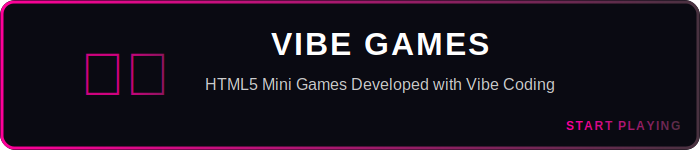
</a>

Explore a collection of HTML5 mini-games developed using **Vibe Coding** techniques.

[**Browse Games Collection**](https://github.com/ryzenadvanced-beep/Custom-Engineered-Agents-and-Tools-for-Vibe-Coders/tree/main/vibecoding-games)

---

- [10% Discount token for Z.AI GLM Models](https://z.ai/subscribe?ic=R0K78RJKNW)
- [TRAE.AI Integration guide with GLM 4.6 Model](https://gitlab.com/ryzenadvanced/ultimate-custom-engineered-coding-agents-trae-ai-glm-4-6-vibe-coding-lab/-/raw/main/Adding_GLM_4.6_Model_to_TRAE__A_Visual_Guide__3_.pdf?inline=true)
- [TRAE.AI and SOLO Agent official page](https://www.trae.ai/s/WJtxyE)

<p align="center">
  <sub>Made by <a href="https://t.me/VibeCodePrompterSystem">RyzenAdvanced</a></sub>
</p>
