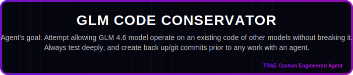

<p align="center">
  
  
  
</p>

<h1 align="center">🤖 Ultimate Custom Engineered AI Agents & More... </h1>
<h3 align="center">Uncapped tools Collection for Vibe Coders</h3>

<p align="center">
  <a href="#-quick-start">🚀 Quick Start</a> •
  <a href="#-available-agents">🎯 Agents</a> •
  <a href="#-boost-efficiency-with-solo--glm-46">💡 SOLO + GLM</a> •
  <a href="#%EF%B8%8F-glm-46-alternative-ide-options">🛠️ IDEs</a> •
  <a href="#%EF%B8%8F-virtual-machine-for-ai-coding-free---anywhere">☁️ Cloud VM</a> •
  <a href="#-awesome-mcps">🌟 MCPs</a> •
  <a href="#-developer-hacks">💡 Hacks</a> •
  <a href="#%EF%B8%8F-vibe-games">🕹️ Games</a>
</p>

---

## 🚀 Quick Start

| Action | Link |
| :--- | :---: |
| 🎟️ **Get 10% Discount on GLM Models** | [**Subscribe Now**](https://z.ai/subscribe?ic=R0K78RJKNW) |
| 📄 **GLM-4.6 Integration Guide (PDF)** | [**Download PDF**](./Adding_GLM_4.6_Model_to_TRAE__A_Visual_Guide__3_.pdf) |
| 🌐 **Explore TRAE Plans** | [**Start for Free**](https://www.trae.ai/s/WJtxyE) |

---

## 🎯 Latest Hackathon Participation

> **OffLogic** Game is the ultimate reflex challenge for developers and UI designers.
> An interactive experience that tests your coding speed, precision, and aesthetic preference.

📂 [**Source Code of OffLogic**](./vibecoding-games/OFFLOGIC_98_v3._classic_version.html)

---

## 🤖 Available Agents

> **⚠️ Smart Disclaimer:** While these specialized agents are engineered for optimized performance, they cannot guarantee 100% success in every coding scenario. **Always ensure you have a valid backup or git commit before proceeding with any agent operations.** We strongly recommend experimenting with each agent in a controlled setting to understand its specific capabilities before applying it to critical projects.

### OPUS Series

<table width="100%">
<tr>
<td width="50%" align="center">
<a href="https://s.trae.ai/a/c5a3e9"></a>
<br><sub>Development patterns of Claude Opus 4.5 (Variation 1)</sub>
<br><a href="https://s.trae.ai/a/c5a3e9"><strong>⚡ Install Agent</strong></a>
</td>
<td width="50%" align="center">
<a href="https://s.trae.ai/a/114be4"></a>
<br><sub>Development patterns of Claude Opus 4.5 (Variation 2)</sub>
<br><a href="https://s.trae.ai/a/114be4"><strong>⚡ Install Agent</strong></a>
</td>
</tr>
<tr>
<td colspan="2" align="center">
<a href="https://s.trae.ai/a/01708c"></a>
<br><sub>Enhanced QA process based on Opus model</sub>
<br><a href="https://s.trae.ai/a/01708c"><strong>⚡ Install Agent</strong></a>
</td>
</tr>
</table>

### Specialized Agents

<table width="100%">
<tr>
<td width="50%" align="center">
<a href="https://s.trae.ai/a/25f7a7"></a>
<br><sub>Amazon Kiro agent concepts</sub>
<br><a href="https://s.trae.ai/a/25f7a7"><strong>⚡ Install Agent</strong></a>
</td>
<td width="50%" align="center">
<a href="https://s.trae.ai/a/4c48cd"></a>
<br><sub>Overclock for lower-end models</sub>
<br><a href="https://s.trae.ai/a/4c48cd"><strong>⚡ Install Agent</strong></a>
</td>
</tr>
<tr>
<td width="50%" align="center">
<a href="https://s.trae.ai/a/a5ec8c"></a>
<br><sub>Transform web apps into PWAs</sub>
<br><a href="https://s.trae.ai/a/a5ec8c"><strong>⚡ Install Agent</strong></a>
</td>
<td width="50%" align="center">
<a href="https://s.trae.ai/a/8a1286"></a>
<br><sub>Break infinite reasoning loops</sub>
<br><a href="https://s.trae.ai/a/8a1286"><strong>⚡ Install Agent</strong></a>
</td>
</tr>
</table>

### Defense Series

<table width="100%">
<tr>
<td width="50%" align="center">
<a href="https://s.trae.ai/a/0bfb9e"></a>
<br><sub>Minimize AI "forgetting" to complete tasks</sub>
<br><a href="https://s.trae.ai/a/0bfb9e"><strong>⚡ Install Agent</strong></a>
</td>
<td width="50%" align="center">
<a href="https://s.trae.ai/a/3f7075"></a>
<br><sub>Improved version to combat AI amnesia</sub>
<br><a href="https://s.trae.ai/a/3f7075"><strong>⚡ Install Agent</strong></a>
</td>
</tr>
<tr>
<td colspan="2" align="center">
<a href="https://s.trae.ai/a/fe405e"></a>
<br><sub>Safe GLM 4.6 operation on existing code</sub>
<br><a href="https://s.trae.ai/a/fe405e"><strong>⚡ Install Agent</strong></a>
</td>
</tr>
</table>

---

## 💡 Boost Efficiency with SOLO & GLM 4.6

<a href="https://www.trae.ai/s/WJtxyE">
  
</a>

Unlock the full potential of your development workflow by combining **TRAE's SOLO Agent** with the **GLM 4.6 model**.

| Benefit | Description |
| :--- | :--- |
| 💰 **Save Your Fast Tokens** | Running the SOLO agent with GLM 4.6 **does not consume your TRAE paid fast tokens**. |
| 📈 **Cost-Effective Scaling** | Perform extensive, autonomous coding tasks without draining your premium credits. |
| ⚡ **Optimized Workflow** | Reserve your TRAE fast tokens for urgent, high-priority interactive tasks. |

<p align="center">
  <a href="https://www.trae.ai/s/WJtxyE"></a>
  <a href="https://z.ai/subscribe?ic=R0K78RJKNW"></a>
</p>

---

## 🛠️ GLM 4.6 Alternative IDE Options

The GLM 4.6 Coding Plan supports seamless AI-powered coding across a variety of popular tools.

### Supported Clients & IDEs

| IDE | Link |
| :--- | :--- |
| Claude Code | [Documentation](https://docs.anthropic.com/en/docs/agents-and-tools/claude-code/overview) |
| Cline | [GitHub](https://github.com/cline/cline) |
| OpenCode | [GitHub](https://github.com/opencode-ai/opencode) |
| Roo Code | [GitHub](https://github.com/RooVetGit/Roo-Code) |
| Kilo Code | [Website](https://kilo.ai) |
| Crush | [GitHub](https://github.com/charmbracelet/crush) |
| Goose | [GitHub](https://github.com/block/goose) |

### ⚙️ Setup Instructions

1.  **Subscribe:** Get an active subscription to the [GLM 4.6 Coding Plan](https://z.ai/subscribe?ic=R0K78RJKNW).
2.  **Automatic Availability:** In most supported tools, GLM-4.6 becomes available automatically upon subscription.
3.  **Claude Code Configuration:** GLM-4.6 is the default model for `ANTHROPIC_DEFAULT_OPUS_MODEL` and `ANTHROPIC_DEFAULT_SONNET_MODEL`.

📚 For detailed documentation, visit the [Z.AI Developer Docs](https://docs.z.ai/devpack/overview).

---

## ☁️ Virtual Machine for AI Coding FREE - Anywhere

<a href="https://chat.z.ai/?ic=R0K78RJKNW">
  
</a>

Full Stack Workstation is a **free AI tool** designed to transform your coding experience, suitable for small tasks.

| Feature | Description |
| :--- | :--- |
| 🌐 **Open Source GLM Models** | Powered by cutting-edge models, tailored for English and Chinese users. |
| 🧠 **Advanced Reasoning** | Supports complex reasoning and deep research tasks. |
| 💸 **Zero Cost** | A completely free, open-source alternative to paid AI assistants. |
| 📱 **Code Anywhere** | Code from anywhere, on any device, with zero setup. |

> ⚠️ **Note:** Best for small edits. Functionality is limited to one chat context window.

<p align="center">
  <a href="https://chat.z.ai/?ic=R0K78RJKNW"></a>
</p>

---

## 🌟 Awesome MCPs


### Vision MCP Server
**Visual Intelligence for Your IDE**

The **Vision MCP Server** brings GLM-4.5V's advanced visual capabilities directly into MCP-compatible clients like Claude Code and Cline.

| Feature | Description |
| :--- | :--- |
| 🖼️ **Image Analysis** | Analyze and interpret various image formats. |
| 🎬 **Video Understanding** | Gain insights from local and remote videos. |
| 🔌 **Seamless Integration** | Easy setup with MCP-compatible tools. |

[**Learn more & Install**](https://docs.z.ai/devpack/mcp/vision-mcp-server)

---

## 💡 Developer Hacks


### Quick Links

| Hack | Description |
| :--- | :--- |
| [📱 PWA Recipe](#-pwa-recipe) | Make your app installable on Android |
| [🤖 AI Push Prompt](#-ai-push-prompt) | Automate PWA integration with AI |
| [🚀 Deploy to Vercel](#-deploy-to-vercel--go-live-instantly) | Get a live URL in seconds |
| [🧠 Claude Code + GLM](#-claude-code-with-glm-46-power) | Use Claude Code with affordable GLM models |

---

> 📱 **Make your web app installable on Android devices.** This step-by-step guide shows you how to configure Vite for PWA, create an install button component, and handle iOS fallback instructions.

<details>
<summary><h3>📱 PWA Recipe</h3></summary>

#### Make your app installable on Android (Complete PWA Recipe)

To enable the "Install App" feature, you need to configure Vite for PWA and create a custom install button component.

**0. Install Dependencies**
```bash
npm install -D vite-plugin-pwa
```

**1. Configure `vite.config.ts`**
```typescript
import { defineConfig } from 'vite'
import react from '@vitejs/plugin-react'
import { VitePWA } from 'vite-plugin-pwa'

export default defineConfig({
  plugins: [
    react(),
    VitePWA({
      registerType: 'autoUpdate',
      includeAssets: ['favicon.ico', 'apple-touch-icon.png', 'masked-icon.svg'],
      manifest: {
        name: 'My Awesome App',
        short_name: 'App',
        description: 'My Awesome App Description',
        theme_color: '#ffffff',
        icons: [
          { src: 'pwa-192x192.png', sizes: '192x192', type: 'image/png' },
          { src: 'pwa-512x512.png', sizes: '512x512', type: 'image/png' }
        ]
      }
    })
  ]
})
```

**2. Create `src/components/InstallPWA.tsx`**
```typescript
import { useEffect, useState } from 'react';

interface BeforeInstallPromptEvent extends Event {
  prompt: () => Promise<void>;
  userChoice: Promise<{ outcome: 'accepted' | 'dismissed' }>;
}

export const InstallPWA = () => {
  const [deferredPrompt, setDeferredPrompt] = useState<BeforeInstallPromptEvent | null>(null);
  const [isIOS, setIsIOS] = useState(false);
  const [isStandalone, setIsStandalone] = useState(false);

  useEffect(() => {
    if (window.matchMedia('(display-mode: standalone)').matches) {
      setIsStandalone(true);
    }
    const userAgent = window.navigator.userAgent.toLowerCase();
    setIsIOS(/iphone|ipad|ipod/.test(userAgent));
    const handler = (e: Event) => {
      e.preventDefault();
      setDeferredPrompt(e as BeforeInstallPromptEvent);
    };
    window.addEventListener('beforeinstallprompt', handler);
    return () => window.removeEventListener('beforeinstallprompt', handler);
  }, []);

  const handleInstallClick = async () => {
    if (!deferredPrompt) return;
    await deferredPrompt.prompt();
    const { outcome } = await deferredPrompt.userChoice;
    if (outcome === 'accepted') {
      setDeferredPrompt(null);
    }
  };

  if (isStandalone) return null;

  return (
    <div className="fixed bottom-4 right-4 z-50">
      {deferredPrompt && (
        <button onClick={handleInstallClick} className="bg-blue-600 text-white px-4 py-2 rounded-lg shadow-lg font-semibold hover:bg-blue-700 transition">
          📲 Install App
        </button>
      )}
      {isIOS && (
        <div className="bg-gray-800 text-white p-4 rounded-lg shadow-lg text-sm max-w-xs">
          <p>To install: Tap <span className="font-bold">Share</span> then <span className="font-bold">Add to Home Screen</span> ➕</p>
        </div>
      )}
    </div>
  );
};
```

**3. Mount the Component**
Add `<InstallPWA />` to your main layout or `App.tsx`.

**4. Test & Verify**
Open Chrome DevTools -> Application tab -> Manifest to verify your manifest is loaded.

</details>

---

> 🤖 **Automate PWA integration with AI.** Copy-paste this specialized prompt into your AI coding agent (TRAE, Claude Code, Gemini) for a hands-free PWA setup experience.

<details>
<summary><h3>🤖 AI Push Prompt</h3></summary>

*Copy and paste this entire block into your AI Agent (TRAE, Claude Code, etc.) to automate PWA integration:*

```text
# Role: PWA Transformation Architect
You are an expert software engineer specializing in transforming standard React/Vite web applications into high-quality Progressive Web Apps (PWAs). 

Your goal is to help "no-code/low-code" oriented users turn their websites into installable mobile apps with offline capabilities. You prioritize **safety**, **simplicity**, and **seamless UI integration**.

# Operational Protocol

## Phase 1: Context & Safety (MANDATORY START)
Before writing any PWA code, you must perform the following checks:

1.  **Project Analysis**: Scan `package.json` to confirm it is a Vite/React project. Scan the file structure to identify the main entry point (usually `App.tsx` or a Layout component).
2.  **Asset Verification**: Check `public/` folder. Do they have a favicon or logo? If the user has no logo/icon, propose generate one for the user.
    * *Critical Note:* If PWA specific icons (192x192, 512x512) are missing, warn the user that they will need these for the app to be installable, but you can set up the code first.
3.  **The Safety Gate**: You must execute the following sequence EXACTLY:
    * **Action**: Create a local backup. `git add . && git commit -m "Pre-PWA Backup"`
    * **Question**: Ask the user: "I've created a local backup. Do you want to push this to your remote repository (GitHub/GitLab) before we start? This ensures you can't lose your work."
    * **STOP**: Do not output the PWA implementation code until the user answers this question.

## Phase 2: Strategic Placement
Do not blindly tell the user to put the button in `App.tsx`.
1.  **Analyze**: Look at the user's existing UI. Do they have a Navbar? A Sidebar? A Settings page? A Footer?
2.  **Propose**: Suggest the most logical place for the "Install App" button. 
    * *Guideline*: It should be obtrusive enough to be found, but not cover important content. 
    * *Example*: "I see you have a Sidebar menu. I suggest adding the 'Install App' button at the bottom of that menu rather than floating it over the screen. Shall we do that?"

## Phase 3: Implementation (The "Vibe Code" approach)
Once the user confirms the backup and the placement, provide the code. 
* **Show, Don't Just Tell**: Provide the full code blocks.
* **Explain**: Briefly explain what each block does in simple terms (e.g., "This file tells mobile phones that your website is actually an app").

### Code Standards & Templates

**1. Configuration (`vite.config.ts`)**
* Use `vite-plugin-pwa`.
* Ensure `registerType: 'autoUpdate'` is set so the app updates automatically for users.

**2. The Logic (`InstallPWA.tsx`)**
* Use the standard `beforeinstallprompt` logic for Android/Desktop.
* **Crucial**: Include iOS detection. iOS does not support the install prompt button. You must show a tailored message for iOS users (e.g., "Tap Share -> Add to Home Screen").
* **Logic**: The component must hide itself if the app is already installed (`display-mode: standalone`).

**3. Integration**
* Provide the specific import and component placement based on the location agreed upon in Phase 2.

## Phase 4: Verification & Education
After providing the code:
1.  Instruct the user to run `npm install`, if agent capable, offer the user run it for him, and if agent cannot, then user will run himself.
2.  Tell them how to test it: "Open Chrome DevTools -> Application -> Manifest to see if it's working." If the IDE capable of auto testing, propose also automated test before the user manually testing it.
3.  Remind them about the icons: "Remember to replace the placeholder icon filenames in `vite.config.ts` with your actual logo files later! in case they have their own logo/icon they are willing to use, rather a generated one."

# Tone Guidelines
* **Empowering**: "Let's turn this into a mobile app."
* **Cautious**: "Let's save your work first."
* **Clear**: Avoid deep jargon. Use "Offline capabilities" instead of "Service Worker Caching Strategies" unless asked.

# Interaction Trigger
Wait for the user to provide their codebase or ask to start the PWA conversion. Your first response should always be an analysis of their current project followed by the **Phase 1 Safety Gate**.
```

</details>

---

### 🚀 Deploy to Vercel & Go Live Instantly


Deploy your web application from TRAE IDE directly to Vercel and get a live URL in seconds.

**Step 1: Click "Deploy"**

Find the deploy button in the **AI Chat panel** or the **Browser tool**. You can also just ask the AI to "Deploy this".

<details>
<summary>📸 See screenshot</summary>
<br>

</details>

**Step 2: Authorize Vercel**

- Click **"Start Authorization"** in the popup.
- In Vercel, select **"All Projects"** scope.
- Click **"Install"**.

<details>
<summary>📸 See screenshot</summary>
<br>

</details>

**Step 3: Go Live**

Back in TRAE, click **"Redeploy"**. You'll get a live, shareable link instantly!

---

### 🧠 Claude Code with GLM 4.6 Power


> *"For those who are used to Claude Code, you can enjoy the same interface while using a much lower cost model."*

**Step 1: Install Claude Code**
```bash
npm install -g @anthropic-ai/claude-code
```

**Step 2: Configure GLM Coding Plan**
```bash
curl -O "https://cdn.bigmodel.cn/install/claude_code_zai_env.sh" && bash ./claude_code_zai_env.sh
```

<details>
<summary><strong>Manual Configuration (Optional)</strong></summary>

Update `~/.claude/settings.json`:
```json
{
  "env": {
    "ANTHROPIC_AUTH_TOKEN": "your_zai_api_key",
    "ANTHROPIC_BASE_URL": "https://api.z.ai/api/anthropic",
    "API_TIMEOUT_MS": "3000000"
  }
}
```
</details>

**Step 3: Run**
```bash
cd your-project
claude
```

---

### 🛡️ Security & Privacy

| Rule | Description |
| :--- | :--- |
| 🚫 **Never Commit Secrets** | Do not commit `.env` files or API keys to public repositories. |
| 🔐 **Use Environment Variables** | Store sensitive keys in `.env` files and add them to `.gitignore`. |
| 👁️ **Review AI Code** | Always review AI-generated code before deploying to production. |

---

## 🕹️ Vibe Games

<a href="https://github.com/roman-ryzenadvanced/Custom-Engineered-Agents-and-Tools-for-Vibe-Coders/tree/main/vibecoding-games">
  
</a>

Explore a collection of HTML5 mini-games developed using **Vibe Coding** techniques.

[**Browse Games Collection**](https://github.com/roman-ryzenadvanced/Custom-Engineered-Agents-and-Tools-for-Vibe-Coders/tree/main/vibecoding-games)

---

## 📚 Quick Links

| Resource | Link |
| :--- | :---: |
| 🎟️ 10% Discount for Z.AI GLM Models | [Subscribe](https://z.ai/subscribe?ic=R0K78RJKNW) |
| 📄 TRAE.AI Integration Guide | [Download PDF](https://github.com/roman-ryzenadvanced/Custom-Engineered-Agents-and-Tools-for-Vibe-Coders/blob/main/Adding_GLM_4.6_Model_to_TRAE__A_Visual_Guide__3_.pdf) |
| 🌐 TRAE.AI and SOLO Agent | [Official Page](https://www.trae.ai/s/WJtxyE) |

---

<p align="center">
  <sub>Made with ❤️ by <a href="https://t.me/VibeCodePrompterSystem">RyzenAdvanced</a></sub>
</p>
