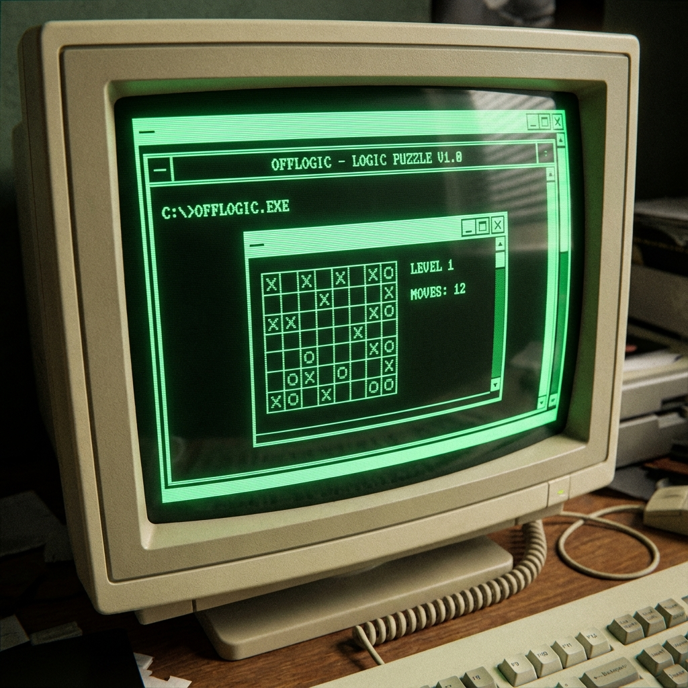
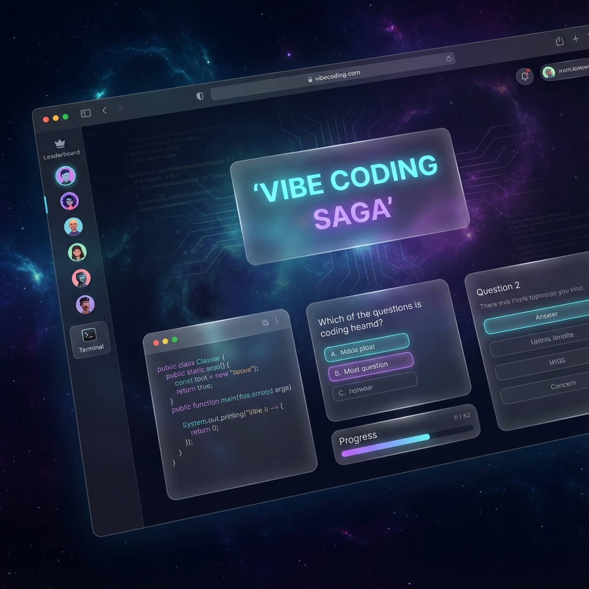
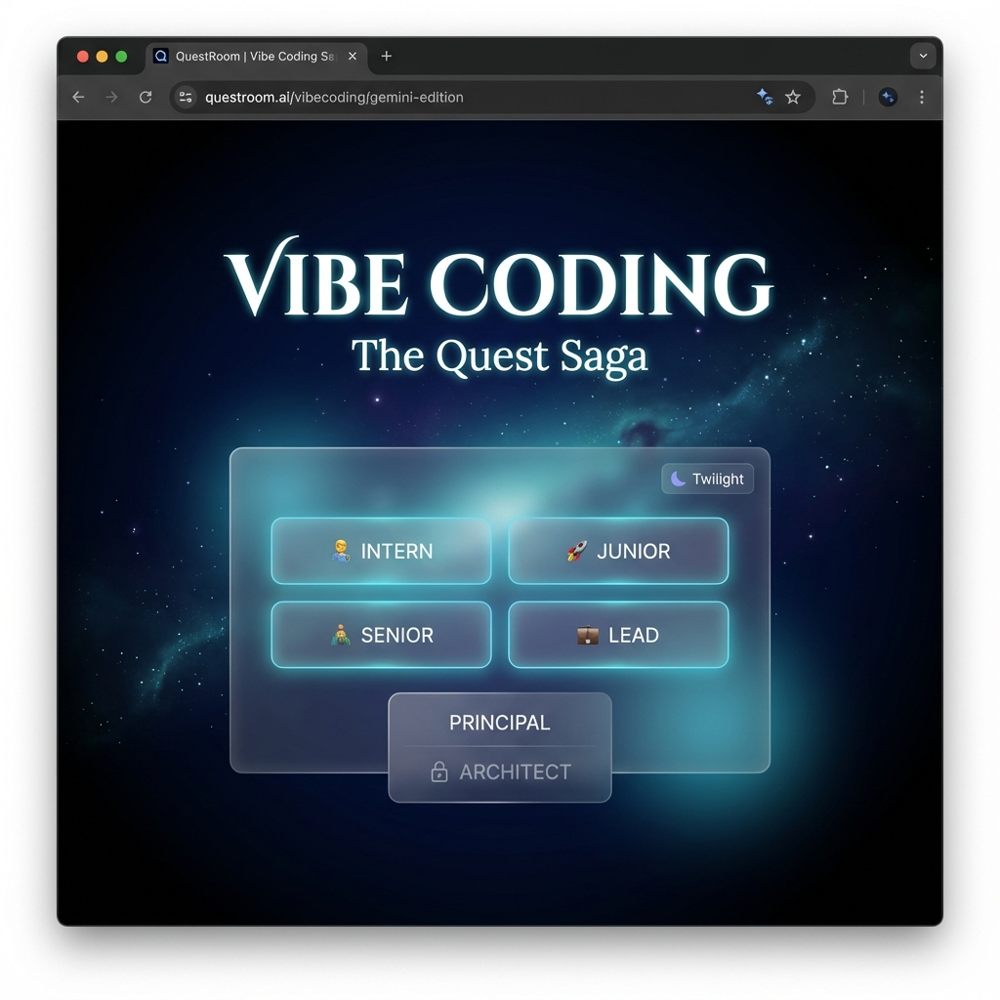

# VibeCoding Games

I am creating here mini html5 based games using vibe coding practice. You may feel free to try my games.

## How to access my mini games:
1. Download the html file.
2. Run it locally in your browser.
3. Enjoy!

--> Go back to the vibe coders blog on gitlab [Here](https://gitlab.com/ryzenadvanced/ultimate-custom-engineered-coding-agents-trae-ai-glm-4-6-vibe-coding-lab/-/blob/master/README.md#-claude-code-with-glm-46-power)

---

## 🎮 Game Showcase

### 1. OFFLOGIC: 98 EDITION
**File:** `OFFLOGIC_98_v3._classic_version.html`

A retro-styled puzzle and logic game that takes you back to the Windows 98 era. Features a CRT monitor aesthetic, scanlines, and "hacking" style gameplay. Test your reflexes and logic skills as you progress through difficulty levels from Novice to Glitch.

---

### 2. QuestRoom | Vibe Coding Saga (GLM 4.6 Edition)
**File:** `VibeCoding_Saga__GLM_4.6_.html`

An immersive coding RPG simulation created with GLM 4.6. Enter the "QuestRoom" and choose your path from Intern to Vibe God. Solve coding challenges against the clock in a beautiful twilight-themed interface with neon indigo aesthetics.

---

### 3. QuestRoom | Vibe Coding Saga (Gemini 3 Edition)
**File:** `VibeCoding_Saga__Gemini_3_.html`

The Gemini 3 Pro generated version of the Vibe Coding Saga. Experience the coding quest with a distinct flavor. Compare how different AI models architect the same game concept while enjoying the deep space coding atmosphere.

---

## Reminder: 

## 📖 How setup GLM 4.6 model wihtin TRAE IDE and SOLO Agent: 

**Setup GLM-4.6 with TRAE:**
*   🎟️ **Need a plan?** Do this first: [**Get 10% Discount** on GLM Models](https://z.ai/subscribe?ic=R0K78RJKNW)
*   📄 **Having GLM Plan already?** [**GLM-4.6 Integration Guide (PDF)**](https://gitlab.com/ryzenadvanced/ultimate-custom-engineered-coding-agents-trae-ai-glm-4-6-vibe-coding-lab/-/blob/master/Adding_GLM_4.6_Model_to_TRAE__A_Visual_Guide__3_.pdf)

### 🚀 Why use SOLO with GLM 4.6?

*   **Save Your Fast Tokens:** Running the SOLO agent with the GLM 4.6 model **does not consume your TRAE paid fast tokens**.
*   **Cost-Effective Scaling:** Perform extensive, autonomous coding tasks without draining your premium credits.
*   **Optimized Workflow:** Reserve your TRAE fast tokens for urgent, high-priority interactive tasks while letting SOLO handle the heavy lifting in the background using GLM 4.6.
*   **Cost per action:** GLM 4.6 offers much lower cost, more affordable vibe coding experience compared to the other major models such as Gemini 3 Pro and Claude Opus 4.5/Sonnet 4.5.
